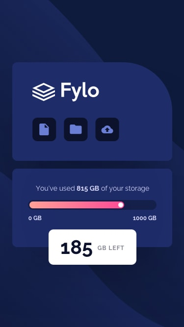

# Frontend Mentor - Fylo storage component
This is a solution to the [Fylo data storage component challenge on Frontend Mentor](https://www.frontendmentor.io/challenges/fylo-data-storage-component-1dZPRbV5n).
### The challenge
The challenge is to build out the data storage component and get it looking as close to the design as possible.
Users should be able to:
- View the optimal layout for the site depending on their device's screen size.
### Built with
- Semantic HTML5 markup
- CSS custom properties
- Flexbox
- CSS Grid
### links
- Live preview:
- Solution URL: 
### Desired Outcome screenshots

